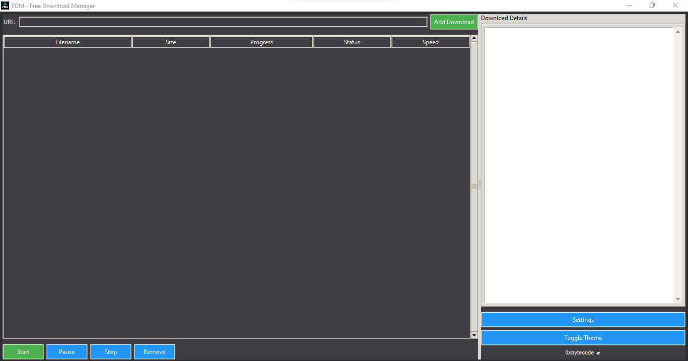

Free/Fast Download Manager 
Overview

A feature-rich download manager built with Python and Tkinter that supports resume functionality, database tracking, and a modern user interface.
Features
Core Functionality

    Multi-threaded Downloads: Supports simultaneous downloads with configurable connections

    Resume Capability: Automatically resumes interrupted downloads

    Progress Tracking: Real-time progress bars with speed and ETA indicators

    Pause/Resume: Control downloads with pause and resume functionality

Enhanced Features

    SQLite Database: All downloads are tracked in a database with history and statistics

    Auto-Resume: Downloads automatically resume when restarting the application

    Silent Mode: Start minimized to system tray with --silent flag

    Keyboard Shortcuts:

        Enter: Add new download from URL field

        Delete: Remove selected download(s)

        Ctrl+Click: Multi-select downloads for batch operations

    Status-Based Coloring:

        Completed: Green

        Error: Red

        Downloading: Blue

        Paused: Orange

        Queued: Gray

        Stopped: Dark Red

User Interface

    Modern Theme: Light and dark theme support

    System Tray Integration: Minimize to system tray

    Detailed Information Panel: View comprehensive download details

    Configurable Settings:

        Download folder path

        Maximum connections

        Chunk size

        Timeout settings

        Proxy configuration

Installation
Requirements

    Python 3.6+

    Required packages:
    bash

pip install requests pillow pystray

Running the Application
bash

# Normal mode
python fdm.py

# Silent mode (starts minimized to tray)
python fdm.py --silent

Usage

    Adding Downloads:

        Enter URL in the text field

        Press Enter or click "Add Download"

    Controlling Downloads:

        Start/Pause: Toggle download state

        Stop: Halt download completely

        Remove: Delete download from list and database

    Batch Operations:

        Use Ctrl+Click to select multiple downloads

        Apply actions (start, pause, stop, remove) to all selected

    Settings:

        Configure download preferences in Settings window

        Toggle between light and dark themes

Technical Details
Database Schema

The application uses SQLite to store:

    Download history and metadata

    Session information and statistics

    Performance metrics and average speeds

File Structure

    Partial downloads are saved with .part extension

    Completed downloads are moved to final location

    Configuration stored in downloader_config.json

    Database stored in downloads.db

Resume Mechanism

The download manager implements a robust resume system that:

    Tracks downloaded bytes in both database and temporary files

    Sends proper range headers for partial content requests

    Validates file integrity on resume

    Handles network interruptions gracefully

Development
Key Components

    DownloadDB: Database management class

    DownloadThread: Threaded download implementation

    DownloadManager: Core download logic and state management

    ModernDownloader: GUI implementation with Tkinter

Extending Functionality

The modular design makes it easy to add:

    New protocol handlers (FTP, BitTorrent, etc.)

    Additional authentication methods

    Plugin system for extended functionality

    Cloud storage integration

Troubleshooting
Common Issues

    Download Stuck: Check network connection and server availability

    Resume Not Working: Verify the server supports range requests

    Permission Errors: Ensure write access to download directory

Logs and Debugging

    Check console for error messages

    Database can be inspected with SQLite tools

    Configuration file located in downloader_config.json

License

This project is released under the MIT License.
Credits

Thanks 

Deepseek-coder for helping in some enhancements 
